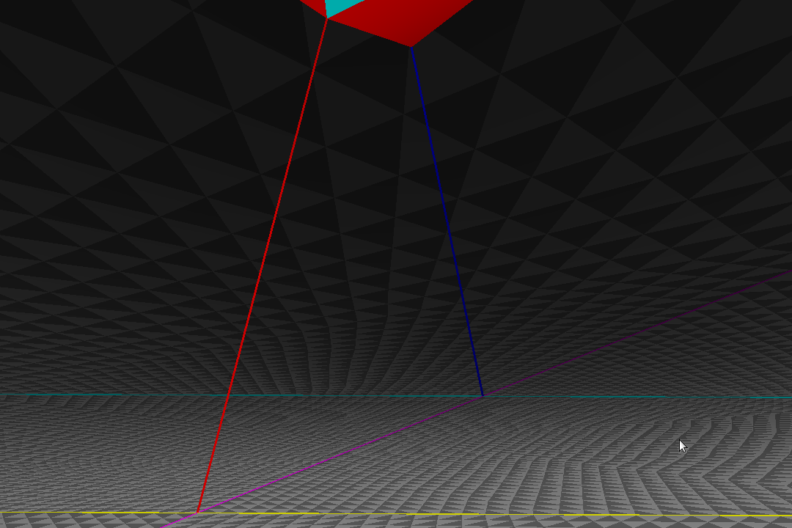

# A Spherical World

A demo on how to render spherically curved 3D space (the 3-sphere) with WebGL.

## Demo



### Desktop controls

| Key | Action |
|-----|--------|
| W/S | Pitch (look up/down) |
| A/D | Yaw (look left/right) |
| Q/E | Roll |
| Up/Down | Move forward/backward |
| H | Toggle overlay |

### Mobile controls

- **Drag** to look around
- **On-screen buttons** for roll and forward/backward movement
- **Tap overlay** to toggle it

## Running

```sh
npm ci
npm run dev
```

Then open the displayed URL in a browser.

## Rendering & Shaders

The vertex shader applies an SO(4) camera transformation (a pair of quaternions `s` and `t`, applied as `s * point * t`) and then projects from the 4D unit sphere to 3D via stereographic projection.

The fragment shader uses distance-based shading: objects closer to the camera on the 3-sphere are brighter, fading toward the antipodal point. Depth ordering is corrected by setting `gl_FragDepth` to the spherical distance, ensuring correct z-ordering despite the non-Euclidean geometry.

## Further reading

- The [Hyperbolica Devlog playlist](https://www.youtube.com/watch?v=EMKLeS-Uq_8&list=PLh9DXIT3m6N4qJK9GKQB3yk61tVe6qJvA) on YouTube provides a great introduction to hyperbolic and spherical space. Its [third video](https://www.youtube.com/watch?v=pXWRYpdYc7Q&list=PLh9DXIT3m6N4qJK9GKQB3yk61tVe6qJvA&index=4) is a great starting point to the topic of rendering hyperbolic or spherical space.
- Grant Sanderson's and Ben Eater's explorable video series [Visualizing Quaternions](https://eater.net/quaternions/) is very helpful to get an intuitive feeling for quaternions.
- Jeff Weeks' [Topology and Geometry Software](https://www.geometrygames.org/) site provides some cool software to get to know unusual spaces. The [Curved Spaces](https://www.geometrygames.org/CurvedSpaces/index.html) app is the most relevant for the topic of 3-sphere rendering.
